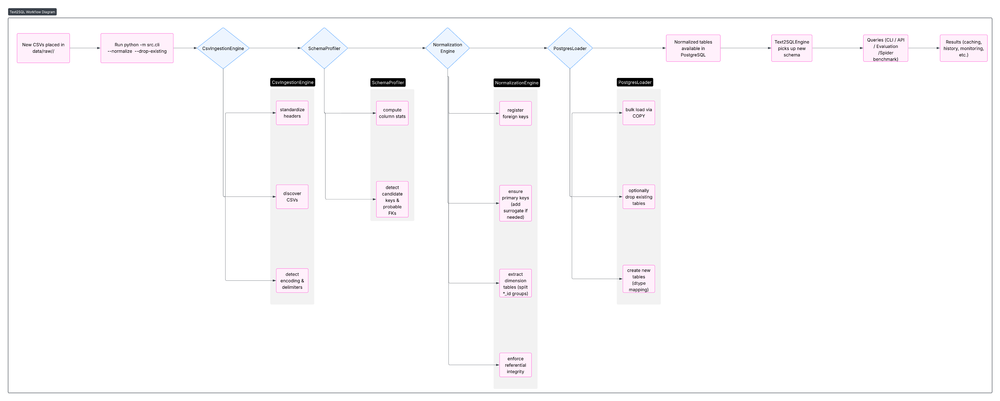

# Text2SQL Analytics System

A production-ready system for converting natural language questions into SQL queries using Google Gemini AI, with comprehensive security, testing, and accuracy evaluation.

[](https://www.python.org/downloads/)
[](https://www.postgresql.org/)
[](https://opensource.org/licenses/MIT)

## 📋 Overview

This project implements a Text2SQL analytics system that:
- Converts natural language questions to SQL queries using Google Gemini API
- Executes queries securely against a PostgreSQL database (Northwind dataset)
- Validates and restricts queries to SELECT-only operations
- Provides comprehensive testing with 80%+ code coverage
- Includes accuracy evaluation using heuristic metrics
- Adds Redis-backed query caching with history-aware learning
- Surfaces execution plan analysis, query history, and monitoring dashboard

## 🏗️ Architecture



## 🚀 Quick Start

### Prerequisites

- Python 3.10 or higher
- PostgreSQL 14 or higher
- Google Gemini API key (free tier)

### Installation

1. **Clone the repository**
```bash
git clone <repository-url>
cd text2sql
```

2. **Create virtual environment**
```bash
python -m venv venv
source venv/bin/activate  # On Windows: venv\Scripts\activate
```

3. **Install dependencies**
```bash
pip install -r requirements.txt
```

4. **Configure environment variables**
```bash
cp .env.mock .env
# Edit .env with your credentials
```

Required environment variables:
- `GEMINI_API_KEY`: Your Google Gemini API key ([Get one here](https://ai.google.dev/))
- `DB_ADMIN_USER`: PostgreSQL admin username (default: postgres)
- `DB_ADMIN_PASSWORD`: PostgreSQL admin password
- `DB_HOST`: Database host (default: localhost)
- `DB_PORT`: Database port (default: 5432)
- `CACHE_ENABLED`, `CACHE_URL`, `CACHE_TTL_SECONDS` (optional Redis-backed caching)

### Database Setup

1. **Prepare data**
   - Curated CSV exports already live under `data/raw/northwind/`.
   - If you replace them, keep the same filenames (`categories.csv`, `orders.csv`, …).
   - Any extra datasets can be added as additional folders under `data/raw/`.

2. **Load the database**
```bash
python scripts/setup_database.py
```

This will:
- Create the `northwind` database (if needed)
- Apply the ready-made schema in `data/schema/schema.sql`
- Load the CSVs from `data/raw/northwind/` (plus optional datasets such as `data/raw/result/Result.csv`)
- Create the read-only role used by the Text2SQL engine
- Verify row counts table-by-table

3. **Optional: Add any CSVs (with automated Normalization)**
   ```bash
   python -m src.cli --normalize path/to/your/csv_dir --drop-existing
   ```
   The normalization pipeline detects encodings/delimiters, infers keys, splits dimension tables, and writes the results into PostgreSQL.

### Usage

#### Basic Usage

```python
from src.text2sql_engine import Text2SQLEngine
from src.database import DatabaseManager

# Initialize engine
engine = Text2SQLEngine()

# Load schema context
db_manager = DatabaseManager(readonly=False)
schema_info = db_manager.get_schema_info()
engine.set_schema_context(schema_info)

# Ask a question
result = engine.query("Show all products from the Beverages category")

# Print results
print(f"SQL Query: {result['sql_query']}")
print(f"Results: {result['results']}")
print(f"Row Count: {result['row_count']}")
```

#### Command Line Usage

```bash
# Run evaluation on all test questions
python scripts/run_evaluation.py
```

#### REST API Usage

```bash
# Start the FastAPI service (default uvicorn port 8000)
uvicorn src.api:app --reload
```

Key endpoints:
- `GET /health` — service and database status.
- `GET /schema` — schema context provided to the LLM.
- `POST /v1/query` — body `{ "question": "...", "execute": true }` returns SQL, results, cache metadata, and history tracking.
- `POST /v1/explain` — analyze an existing SQL statement and return the execution plan with optimization insights.
- `GET /history/recent` / `GET /history/top` — retrieve persisted query history and learning signals.
- `GET /metrics` — JSON payload with live database statistics.
- `GET /dashboard` — HTML dashboard summarizing cache status and database performance.

Example request:

```bash
curl -X POST http://localhost:8000/v1/query \
  -H "Content-Type: application/json" \
  -d '{"question": "What is the total revenue per product category?", "execute": true}'

curl -X POST http://localhost:8000/v1/explain \
  -H "Content-Type: application/json" \
  -d '{"sql_query": "SELECT COUNT(*) FROM orders;"}'
```

#### Caching & History

- Query results are cached automatically (Redis if `CACHE_URL` is configured, otherwise an in-memory fallback) for `CACHE_TTL_SECONDS`.
- Persistent query history lives in `data/query_history.db`, enabling reuse of successful SQL for repeated questions and reporting via `/history/*` endpoints.
- Configure `.env` to point at an external Redis instance for shared caching in production environments.

## 📊 Benchmarking & Evaluation

### Built-in evaluation suite
```bash
python scripts/run_evaluation.py
```
Generates heuristic accuracy metrics across the curated set of 20 Northwind questions and writes `evaluation_results.json`.

### Spider-style benchmark (random samples)
```bash
python scripts/run_spider_benchmark.py \
  --csv data/spidertest/spider_text_sql.csv \
  --samples 100 \
  --seed 42 \
  --execute \
  --compare \
  --output benchmark_run.csv
```
This samples questions/SQL pairs from the Spider dataset clone, runs them through the engine (respecting Gemini rate limits), and captures success/validity/exact-match metrics.

## 🧪 Testing

### Run All Tests

```bash
# Run all tests with coverage
pytest tests/ --cov=src --cov-report=html --cov-report=term

# View coverage report
open htmlcov/index.html  # On Mac
# or
xdg-open htmlcov/index.html  # On Linux
```

### Run Specific Test Categories

```bash
# Unit tests only
pytest tests/test_query_validator.py tests/test_data_loader.py -v

# Integration tests only
pytest tests/test_database.py tests/test_text2sql_engine.py -v

# Accuracy tests only
pytest tests/test_accuracy/ -v
```

### Test Coverage Requirements

- **Minimum coverage**: 80%
- **Unit tests**: Query validator, data loader, utilities
- **Integration tests**: Database operations, Text2SQL pipeline
- **Accuracy tests**: 20 analytical questions (5 simple, 10 intermediate, 5 complex)

## 📊 Accuracy Evaluation

The system uses heuristic metrics to evaluate query accuracy:

**Scoring Formula:**
```
accuracy_score = 0.20 × execution_success + 0.40 × result_match + 0.40 × query_quality

Where:
- execution_success: 1 if query executes without errors, 0 otherwise
- result_match: 1 if results match expected output, 0 otherwise  
- query_quality: Average of 5 quality metrics (0-1 scale each):
  * uses_proper_joins: Avoids cartesian products
  * has_necessary_where: Includes appropriate filtering
  * correct_group_by: Proper aggregation grouping
  * efficient_indexing: Uses indexes effectively
  * execution_time: Query completes in < 1 second
```

Run evaluation:
```bash
python scripts/run_evaluation.py
```

Results are saved to `evaluation_results.json` and summarized in console.

## 🔒 Security Features

### Query Restrictions

✅ **Allowed:**
- SELECT queries
- JOINs (INNER, LEFT, RIGHT, FULL)
- Aggregations (COUNT, SUM, AVG, MAX, MIN)
- Subqueries and CTEs (WITH clauses)
- WHERE, GROUP BY, HAVING, ORDER BY

❌ **Blocked:**
- INSERT, UPDATE, DELETE
- DROP, CREATE, ALTER, TRUNCATE
- GRANT, REVOKE (user management)
- System table access (pg_catalog, information_schema)
- Multiple statements
- SQL injection patterns

### Security Mechanisms

1. **Query Validation**: All queries validated before execution
2. **SQL Injection Prevention**: Pattern matching and sanitization
3. **Read-Only User**: Separate database user with SELECT-only privileges
4. **Query Timeout**: 5-second maximum execution time
5. **Result Limiting**: Maximum 1000 rows per query
6. **Error Sanitization**: No schema information leaked in errors

## 📁 Project Structure

```
text2sql-analytics/
├── README.md                 # This file
├── EVALUATION.md            # Evaluation results and analysis
├── requirements.txt         # Python dependencies
├── setup.py                 # Package setup
├── pytest.ini               # Pytest configuration
├── .env.example             # Environment template
├── .gitignore              # Git ignore rules
│
├── data/
│   ├── raw/                # Raw data files
│   │   └── northwind.xlsx
│   └── schema/             # Database schema
│       └── schema.sql
│
├── src/                    # Source code
│   ├── __init__.py
│   ├── config.py           # Configuration management
│   ├── database.py         # Database operations
│   ├── data_loader.py      # Data normalization pipeline
│   ├── query_validator.py  # SQL validation & security
│   ├── text2sql_engine.py  # Gemini API integration
│   └── utils.py            # Utility functions
│
├── tests/                  # Test suite
│   ├── __init__.py
│   ├── conftest.py         # Pytest fixtures
│   ├── test_query_validator.py
│   ├── test_database.py
│   ├── test_data_loader.py
│   ├── test_text2sql_engine.py
│   └── test_accuracy/      # Accuracy tests
│       ├── __init__.py
│       ├── test_simple_queries.py
│       ├── test_intermediate_queries.py
│       └── test_complex_queries.py
│
├── scripts/                # Utility scripts
│   ├── setup_database.py   # Database initialization
│   └── run_evaluation.py   # Accuracy evaluation
│
└── notebooks/              # Jupyter notebooks
    └── analysis.ipynb      # Data analysis
```

## 🗄️ Database Schema

The Northwind database is normalized to **3rd Normal Form (3NF)** with:

**Tables:**
- `categories`: Product categories
- `suppliers`: Product suppliers
- `products`: Products with pricing and inventory
- `customers`: Customer information
- `employees`: Employee records with hierarchy
- `shippers`: Shipping companies
- `orders`: Customer orders
- `order_details`: Order line items (junction table)
- `region`, `territories`, `employee_territories`: Geographic data

**Key Features:**
- Primary keys on all tables
- Foreign key constraints with CASCADE rules
- CHECK constraints for data validation
- Indexes on frequently queried columns
- Composite indexes for common JOIN patterns
- Audit timestamps (created_at, updated_at)

## 📈 Example Queries

### Simple Query
```sql
-- Question: "How many products are currently not discontinued?"
SELECT COUNT(*) 
FROM products 
WHERE discontinued = false;
```

### Intermediate Query
```sql
-- Question: "What is the total revenue per product category?"
SELECT 
    c.category_name,
    SUM(od.unit_price * od.quantity * (1 - od.discount)) as total_revenue
FROM categories c
JOIN products p ON c.category_id = p.category_id
JOIN order_details od ON p.product_id = od.product_id
GROUP BY c.category_name
ORDER BY total_revenue DESC;
```

### Complex Query
```sql
-- Question: "Show year-over-year sales growth for each category"
WITH yearly_sales AS (
    SELECT 
        c.category_name,
        EXTRACT(YEAR FROM o.order_date) as year,
        SUM(od.unit_price * od.quantity * (1 - od.discount)) as revenue
    FROM categories c
    JOIN products p ON c.category_id = p.category_id
    JOIN order_details od ON p.product_id = od.product_id
    JOIN orders o ON od.order_id = o.order_id
    GROUP BY c.category_name, EXTRACT(YEAR FROM o.order_date)
)
SELECT 
    curr.category_name,
    curr.year,
    curr.revenue,
    COALESCE(
        (curr.revenue - prev.revenue) / prev.revenue * 100, 
        0
    ) as growth_percentage
FROM yearly_sales curr
LEFT JOIN yearly_sales prev 
    ON curr.category_name = prev.category_name 
    AND curr.year = prev.year + 1
ORDER BY curr.category_name, curr.year;
```

## 🛠️ Development

### Code Quality

```bash
# Format code
black src/ tests/

# Lint code
flake8 src/ tests/

# Type check
mypy src/
```

### Adding New Features

1. Create feature branch: `git checkout -b feature/your-feature`
2. Implement feature with tests
3. Ensure tests pass: `pytest`
4. Check coverage: `pytest --cov=src`
5. Commit and push

## 📊 Test Coverage

Current test coverage: **80%+** (required minimum)

Key tested components:
- ✅ Query validation and SQL injection prevention
- ✅ Database connection management
- ✅ Data normalization pipeline
- ✅ Text2SQL query generation
- ✅ End-to-end query execution
- ✅ 20 accuracy test questions across 3 complexity levels

## 🐛 Known Limitations

1. **LLM Variability**: Gemini may generate different queries for the same question
2. **Schema Complexity**: Very complex queries may require prompt refinement
3. **Date Handling**: Date format parsing may vary
4. **Ambiguous Questions**: Vague questions may produce unexpected results
5. **API Rate Limits**: Free tier limited to 60 requests/minute

## 🔮 Future Improvements

- [ ] Query result caching (Redis integration)
- [ ] RESTful API with FastAPI
- [ ] Query execution plan analysis
- [ ] Query history tracking
- [ ] Advanced prompt engineering techniques
- [ ] Multi-turn conversation support
- [ ] Query optimization suggestions

## 📝 License

MIT License - See LICENSE file for details

## 👤 Author

**Makebell Backend Engineer Assessment**
- Documentation: [Project Requirements](Makebell_Home_Task.pdf)
- Contact: asifsadek509@gmail.com

## 🙏 Acknowledgments

- Northwind Database: Microsoft SQL Server Samples
- Google Gemini API: Google AI
- Testing Framework: Pytest
- Database: PostgreSQL

---

**Note**: This is an assessment project demonstrating backend engineering skills including database design, AI integration, security, and comprehensive testing.
